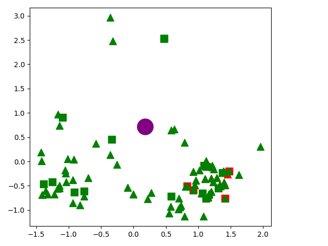
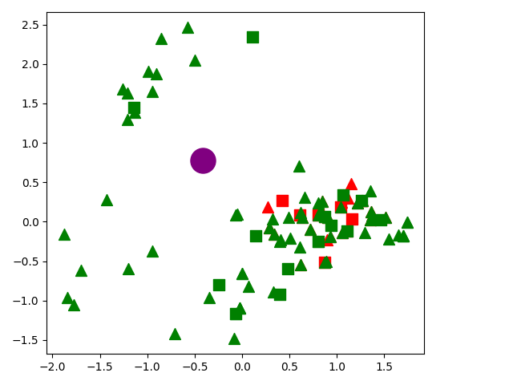
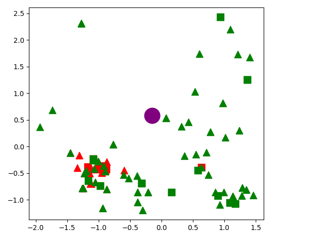

[](https://opensource.org/license/mit) 


# HyQE: Ranking Contexts with Hypothetical Query Embeddings

This repository contains the codebase for the EMNLP long paper submission: **HyQE: Ranking Contexts with Hypothetical Query Embeddings**.

## News
- **[2024.10]** Paper is accepted and to appear at EMNLP 2024.

## 🤔 What is HyQE?

**Hypothetical Query Embeddings (HyQE)** is a novel context-ranking method designed to improve retrieval-augmented generation systems. It leverages **large language models (LLMs)** to generate hypothetical queries from the contexts, builds an index for these queries, and ranks contexts by comparing user queries against the hypothetical ones. Our method is grounded in variational inference: treating contexts and queries as belonging to distinct domains. While cosine similarity measures in-domain relevance, LLMs act as a bridge between these domains.

<p align="center">
    
</p>

### 🤔 Why HyQE?

The key insight of HyQE is that, rather than directly comparing the similarity between a query and contexts, HyQE focuses on **query-to-query similarities**. We observe that contexts (🟥) with embeddings closest to the query (🟣) do not always provide the best answers. In contrast, HyQE retrieves contexts with more diverse embeddings (🟩), leading to more relevant and accurate answers to the queries.
 
<p align="center">
    
    
    
</p>
 

## Table of Contents
 
- [Installation](#installation)
- [Authentication](#authentication)
- [Structure](#structure)
- [Running Experiments](#running-experiments)
- [License](#license)

## Installation 

1. **Create a Conda Environment**
    ```sh
    conda create -n hyqe python=3.10
    conda activate hyqe
    ```

2. **Install Python Dependencies**
    - Install Python dependencies:
        ```sh
        pip install -e .
        ```
    - Install Faiss:
        ```sh
        conda install -c pytorch -c nvidia faiss-gpu=1.8.0
        ```
        (Refer to the [Faiss installation tutorial](https://github.com/facebookresearch/faiss/blob/main/INSTALL.md) for more details)
    - Run the installation script to install pyserini, arserini (recommended to review the script content beforehand):
        ```sh
        bash install.sh
        ``` 

3. **Download Cached Hypothetical Queries** (Skip if you prefer to generate queries using your LLM)
    - Manually download the shared file from [this link](https://drive.google.com/file/d/11enMG6c7nEbwUHcyyYHNJGzos2yoKcwt/view?usp=sharing), or
        ```
        gdown 11enMG6c7nEbwUHcyyYHNJGzos2yoKcwt
        ```
    - Decompress the file  
        ```
        unzip emnlp.zip
        ```
    - Find the `cache` folder after decompression is finished. Move `cache` to [`hyqe/hyqe/src`](hyqe/hyqe/src) and rename it to `.cache`
        ```
        mv cache hyqe/hyqe/src/.cache
        ```

## Authentication
 
- In the repo's root directory, create a file named `key.yaml`.
- Add your API keys:
    ```yaml
    OPENAI_API_KEY: XXXX
    HF_TOKEN: XXXX
    ```

## Structure

- **[`pyserini`](pyserini/)**: Contains a fork of the [official Pyserini repository](https://github.com/castorini/pyserini/blob/master/docs/prebuilt-indexes.md).
    > Note: The `install.sh` script modifies certain files in Pyserini. Please review the script for details.

- **[`hyqe/hyqe/src`](hyqe/hyqe/src/)**: Contains the source code for using hypothetical queries to enhance the RAG system, based on [HyDE](https://github.com/texttron/hyde).
    - **[`generator.py`](hyqe/hyqe/src/generator.py)**: Classes for wrapping OpenAI and open-source models for hypothetical query generation.
    - **[`encoder.py`](hyqe/hyqe/src/encoder.py)**: Classes for wrapping embedding models, including OpenAI's text-embedding-large-3 and open-source models.
    - **[`hyqe.py`](hyqe/hyqe/src/hyqe.py)**: Implementation of the HyQE algorithm.

## Running Experiments

1. Locate the script [`run.sh`](hyqe/hyqe/run.sh).
2. Edit the variables in `run.sh` to set the arguments as explained in the comments.
3. Execute the script:
    ```sh
    ./run.sh
    ```
    (Run this command from the [`hyqe/hyqe`](hyqe/hyqe) directory)

4. Collect the results from [`log.txt`](hyqe/hyqe/log.txt) or the [`results`](hyqe/hyqe/results/) directory.

## License

This project is licensed under the MIT License - see the [LICENSE](LICENSE) file for details.
 
## Citation

If you use this codebase in your research, please cite our paper:

```
@article{zhou2024hyqe,
  title={HyQE: Ranking Contexts with Hypothetical Query Embeddings},
  author={Zhou, Weichao and Zhang, Jiaxin and Hasson, Hilaf and Singh, Anu and Li, Wenchao},
  journal={arXiv preprint arXiv:2410.15262},
  year={2024}
}
```
 
